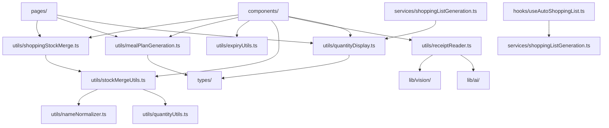

# Cookletプロジェクト - ビジネスロジック散在問題詳細分析

## 1. 現在の問題状況

### 1.1 依存関係マップ

#### utils/ディレクトリの実際の依存関係



#### 重複機能の具体例

1. **食材名正規化機能** ⚠️ **CRITICAL重複**
   
   **場所1**: `utils/autoShoppingList.ts` - `normalizeIngredientName()`
   ```typescript
   export const normalizeIngredientName = (name: string): string => {
     return name
       .toLowerCase()
       .replace(/[、，\s]+/g, '') // 句読点・空白除去
       .replace(/[(（][^)）]*[)）]/g, '') // 括弧内除去
       .replace(/[0-9]+[gkgml個本枚枚切れパック]/g, '') // 数量単位除去
       .trim();
   };
   ```
   
   **場所2**: `services/shoppingListGeneration.ts` - `normalizeIngredientName()`
   ```typescript
   const normalizeIngredientName = (name: string): string => {
     return name
       .toLowerCase()
       .replace(/\s+/g, '')
       .replace(/[（）()]/g, '')
       .trim();
   };
   ```
   
   **場所3**: `utils/nameNormalizer.ts` - `normalizeProductName()`
   ```typescript
   // より高機能な正規化（食材マスタとの照合付き）
   ```
   
   **問題**: 
   - 同名関数で異なる実装（regex パターンが違う）
   - 処理精度が異なるため統合時に動作変更リスク
   - どれを正解とするか判断困難

2. **数量処理機能**
   - `utils/autoShoppingList.ts` - `extractQuantity()`
   - `services/shoppingListGeneration.ts` - `normalizeQuantity()`
   - `utils/quantityUtils.ts` - 完全なQuantity型演算

3. **在庫チェック機能**
   - `utils/autoShoppingList.ts` - `checkIngredientStock()`
   - `services/shoppingListGeneration.ts` - `isStockSufficient()`

### 1.2 ビジネスロジック vs ユーティリティの境界

#### 純粋なユーティリティ (移行対象外)
- `dateFormatters.ts` - 日付フォーマット
- `errorHandlers.ts` - エラーハンドリング
- `numberConverter.ts` - 数値変換
- `quantityDisplay.ts` - 表示用フォーマット
- `quantityUtils.ts` - Quantity型演算

#### ビジネスロジック (移行対象)
- `mealPlanGeneration.ts` - 献立自動生成アルゴリズム
- `autoShoppingList.ts` - 買い物リスト生成（重複機能）
- `stockMergeUtils.ts` - 在庫マージ処理
- `shoppingStockMerge.ts` - 買い物→在庫統合
- `receiptReader.ts` - レシート読み取り処理
- `expiryUtils.ts` - 期限チェック処理

#### 曖昧な位置づけ (検討要)
- `nameNormalizer.ts` - 商品名正規化（ビジネスルール含む）

## 2. 具体的な技術的課題

### 2.1 Circular Dependency リスク

**現在のリスク箇所**:
```
services/shoppingListGeneration.ts 
  ↓ import
utils/quantityDisplay.ts
  ↓ potential future import
business-logic/[new-service]
  ↓ import 
services/[existing-service]
```

### 2.2 Import文変更規模

#### 直接影響ファイル (15ファイル)
- `components/dialogs/MealGenerationResultDialog.tsx`
- `components/meal-plans/MealPlansGenerator.tsx`
- `pages/meal-plans/MealPlans.tsx`
- `pages/shopping/Shopping.tsx`
- `components/shopping/ReceiptReader.tsx`
- `components/summary/StockAlertSection.tsx`
- その他9ファイル

#### 間接影響 (型定義変更)
- `utils/mealPlanGeneration.ts`の型エクスポートを使用している全ファイル

### 2.3 テスト影響範囲

#### 既存テスト
- `test/autoShoppingList.test.ts` (15テストケース)
- `test/mealPlanGeneration.test.ts` (8テストケース)
- `utils/`配下の10個のテストファイル

#### 移行時の懸念
- テストファイルのimport path変更
- モックオブジェクトの再設定
- 統合テストでの整合性確認

## 3. Martin Fowler手法に基づく段階的リファクタリング戦略

### Phase 1: 重複排除 (リスク: 低) - 改訂版

#### 目標
重複している関数を統一し、単一の実装に集約する

#### 戦略の選択
**Option A**: より厳密な正規化（autoShoppingList.ts版）を採用
**Option B**: よりシンプルな正規化（shoppingListGeneration.ts版）を採用  
**Option C**: 新しい統一実装を作成

**推奨**: **Option A** - autoShoppingList.ts版が最も包括的

#### 手順 (Martin Fowler: Extract Function → Move Function)
1. **Create Unified Function**: `utils/textNormalizer.ts`に統一関数を作成
   ```typescript
   export const normalizeIngredientName = (name: string): string => {
     return name
       .toLowerCase()
       .replace(/[、，\s]+/g, '') // 句読点・空白除去
       .replace(/[(（][^)）]*[)）]/g, '') // 括弧内除去  
       .replace(/[0-9]+[gkgml個本枚枚切れパック]/g, '') // 数量単位除去
       .trim();
   };
   ```

2. **Replace Function Calls**: 既存の2ファイルで共通関数をimport
   - `services/shoppingListGeneration.ts`: 内部関数を削除、import追加
   - `utils/autoShoppingList.ts`: export削除、import追加

3. **Test Verification**: 既存テスト実行で動作確認

4. **Remove Dead Code**: 重複した内部関数を削除

#### 影響範囲 (実測)
- **変更ファイル**: 3ファイル（新規1、修正2）
- **外部import**: なし（内部関数のため安全）
- **テスト影響**: 既存テスト継続動作
- **破壊的変更**: なし（内部実装変更のみ）

### Phase 2: 純粋関数の分離 (リスク: 低)

#### 目標
副作用のない純粋な計算処理を`lib/`配下に移動

#### 候補
- `quantityUtils.ts` → `lib/quantity/`
- `nameNormalizer.ts` → `lib/normalization/`

#### 手順
1. **Move File**: ファイルを新しい場所に移動
2. **Update Imports**: import文を一括更新
3. **Verify Tests**: テストが継続して動作することを確認

### Phase 3: ビジネスロジックの階層化 (リスク: 中)

#### 目標
ビジネスロジックを適切な階層に配置

#### 新しいディレクトリ構成
```
src/
├── lib/                 # 純粋な計算・変換処理
│   ├── quantity/        # 数量計算
│   ├── normalization/   # 正規化処理
│   └── date/           # 日付処理
├── business-logic/      # ドメインロジック
│   ├── meal-planning/   # 献立関連
│   ├── inventory/       # 在庫管理
│   ├── shopping/        # 買い物
│   └── receipt/         # レシート処理
└── services/           # アプリケーションサービス
    ├── notification/    # 通知
    └── integration/     # 外部連携
```

### Phase 4: サービス層の再構築 (リスク: 高)

#### 目標
適切な責任分離とレイヤードアーキテクチャの確立

#### 手順
1. **Extract Class**: 関連する機能をクラスに集約
2. **Move Method**: メソッドを適切なクラスに移動
3. **Introduce Service Layer**: サービス層の明確な定義

## 4. 実行計画

### 第1週: Phase 1 (重複排除)
- [ ] `normalizeIngredientName`関数の統一
- [ ] 重複する数量処理関数の整理
- [ ] テスト実行・動作確認

### 第2週: Phase 2 (純粋関数分離)
- [ ] `lib/`ディレクトリ構成の設計
- [ ] 純粋関数の移動
- [ ] import文の一括更新

### 第3週: Phase 3 (ビジネスロジック階層化)
- [ ] `business-logic/`ディレクトリの作成
- [ ] ドメインロジックの分類・移動
- [ ] 各フィーチャーごとの責任分離

### 第4週: Phase 4 (サービス層再構築)
- [ ] サービス層の責任範囲定義
- [ ] 統合テストの追加
- [ ] パフォーマンス影響の検証

## 5. リスク軽減策

### Circular Dependency対策
- 依存関係グラフの継続監視
- eslint-plugin-import-cycleの導入検討
- レイヤー間の単方向依存の強制

### 段階的移行
- 各フェーズでの完全なテスト実行
- フィーチャーフラグによる段階的切り替え
- rollback計画の準備

### 品質保証
- 移行前後でのE2Eテスト実行
- パフォーマンス測定
- ユーザー影響の最小化

## 6. 成功指標

### 定量的指標
- 重複コード行数: 50%削減目標
- ファイル間依存関係: 30%単純化
- テストカバレッジ: 現状維持

### 定性的指標
- コードの理解しやすさ向上
- 新機能開発速度の向上
- バグ発生率の削減

## 7. 即実行可能なアクション

### 今すぐ実行 - Phase 1 重複排除 (所要時間: 30分)

#### Step 1: 統一関数の作成 (5分)
```bash
# 新しいファイルを作成
touch src/utils/textNormalizer.ts
```

#### Step 2: テスト実行で現状確認 (5分)  
```bash
pnpm run lint && pnpm run build:netlify
pnpm test -- autoShoppingList
pnpm test -- mealPlanGeneration
```

#### Step 3: 統一関数の実装 (10分)
- `utils/textNormalizer.ts`に最適化された正規化関数を実装
- 既存の2つの実装から最良の要素を統合

#### Step 4: リファクタリング実行 (10分)
- `services/shoppingListGeneration.ts`でimport追加、内部関数削除
- `utils/autoShoppingList.ts`でimport追加、export削除
- import文の調整

#### Step 5: 動作確認・完了 (10分)
```bash
pnpm run lint && pnpm run build:netlify
pnpm test -- autoShoppingList  
pnpm test -- mealPlanGeneration
git add . && git commit -m "refactor: normalizeIngredientName関数の重複排除"
```

### 次週以降の計画

1. **詳細設計**: `lib/`と`business-logic/`の具体的構成
2. **ツール導入**: 依存関係監視とテスト自動化  
3. **段階的移行**: Phase 2-4の順次実行

### 成功確認指標

- [ ] lint・buildが継続して成功
- [ ] 既存テストが全て通過
- [ ] 重複コード削除（約20行削減）
- [ ] Circular dependency発生なし

---

*この分析は2025-07-12時点のコードベースに基づいています。*
*Martin Fowlerのリファクタリング手法に従い、安全で段階的な改善を目指します。*